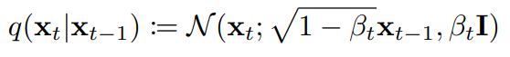
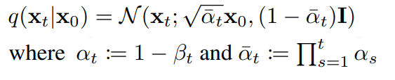
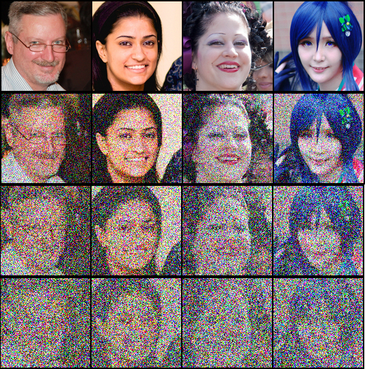
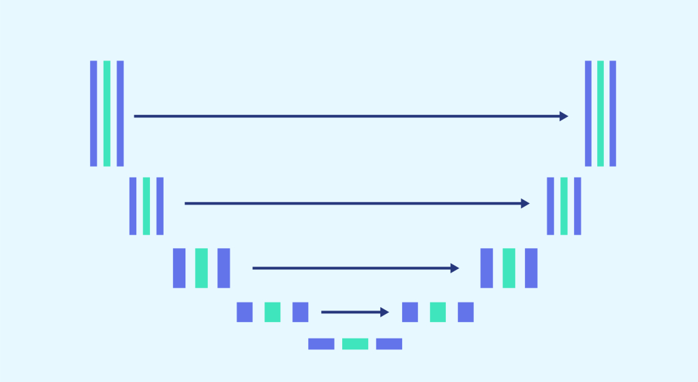
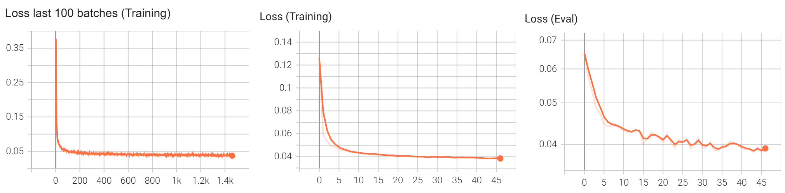
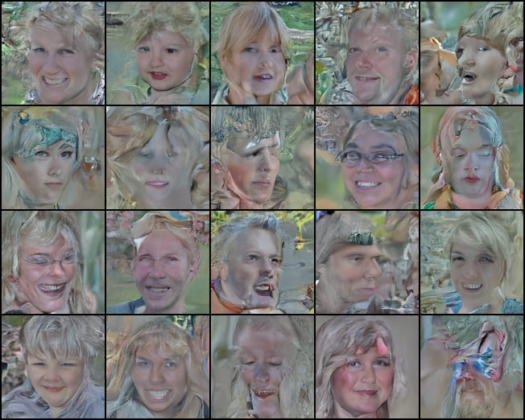
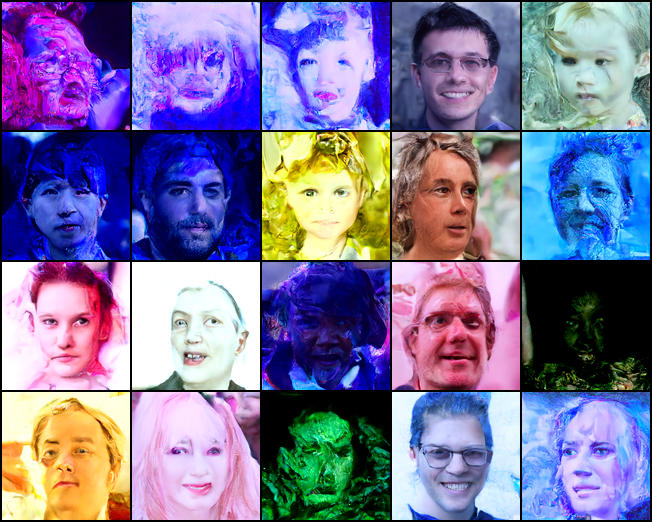

# Denoising Diffusion Probabilistic Model in PyTorch

.gif>)

In this repository, I will implement my own version of a denoising diffusion model to synthesize images, according to the specifications found in the orginal paper: *Denoising Diffusion Probabilistic Models* by J.Ho et al. I will take the reader through the different steps are that required to implement such a model

During the forward process, noise is gradually added to the original image $x_0$, where the new image $x_t$ only depends on the previous image $x_{t-1}$. Noise is added from a Gaussian distribution such that the produced image will gradually move to a distribution with pure noise from the standard normal distribution. The amount of noise added at each step is managed using $\beta_t$, and is usually gradually increased as the steps increase. A single forward transition is achieved using: 



However, since iteratively adding Gaussians only results in a new Gaussian, we can calculate the accumulated noise scaling over any number of steps, and sample the distorted image at any time step t, directly from the original image. This results in the following formula:



I have implemented the noise scheduler and the actual noise sampling process in *functions/noise_schedulur.py*. The following images are a sample of the noise process, directly calculated at t's of 0, 66, 132 and 200.



During training, we randomly draw t from a uniform distribution, where t is different for every sample in the batch. For $\beta_t$, I use a schedule that linearly increases from $\beta_{start}$ to $\beta_{end}$ as the steps increase.

## Step 2: Predicting the added Noise: Modified U-NET


The used model has been implemented from scratch by me, and I aimed to keep its formulation as close to the architecture used in the original paper. The official tensorflow implementation of the authors was used in the process.

The UNET architecture is an auto-encoder, where the spatial dimensions are gradually reduced while the amount of channels are increased. After reaching a bottleneck, the process is reversed, and spatial dimensions are gradually increased while channels are reduced, untill we once again reach the initial dimensions. To prevent a vanishing gradient, and preserve finer information, intermediary states during downsampling are saved, and then slowly concatenated again at each level of upsampling.

My implementation consists of 5 resolution levels (from 128x128 to 8x8). For downsampling, each resolution levels consists of 2 ResNet block, and for upsampling, 3 ResNet blocks. At the resolution levels of 16x16, and in the bottleneck, we also use self-attention layer.

### Timestep embedding: Sinusodial 
The same model is used to predict the added noise for all different timesteps, and thus with different amounts of noise. It is thus helpfull to give the model information about which timestep we are currently predicting for each image. To achieve this, a sinusodial embeddings like the one detailed in "Attention is all you need" is used throughout the model. More specifically, this embedding is summed to the current state at the start of each resnet-block.

A sinusodial embedding is a collection of Sin and Cos functions applied to the posiition (or timestep) of the sample. The collection consists of Sin and Cos functions at different frequencies. These different frequencies allow the model to differentiate between timesteps at different scales. The benefits of a sinusodial embedding is that they dont have to be learned, and any learned relationship naturally extends between and even outside of the timesteps the relationships was learned at.

## Step 3: Training the model
The model was trained on the Flickr-Faces-HQ Dataset at 128x128. The dataset contains a total of 70.000 images, of which 63k were used for training, and 7k were used for validation. The model was trained using the following settings. Gradient accumnalation was also used, only applying the gradients every 4th batch. For the loss, the Mean Squared error between the noise and the predicted noise is used.

```
diff_config = DiffusionConfig(
    dataset_name = "FFHQ",
    learning_rate = 0.00003,
    batch_size= 20,
    use_augmentation = False,
    timesteps_diff = 200,
)
model_config = ModelConfig(
    lowest_resolution_size = 8,
    dim_multiply = [1,2,2,4,8],
    transformer_layers = [3],
    base_dim = 64
)
```

Unfortunately, the size of both the images, and the feature dimensions had to be limited due to VRAM-limits. Based on results in the literature, you would almost surely see improved performance if u used a higher *base dim* (256 for example).

Using more timesteps would probably also result in better results (1000 vs 200)

### Training monitoring



The training and validaton curves seem very healthy, without any observed spikes or any overfitting being observed.

## Step 4: Sampling new images

Todo: give better/ more in depth-explanation:

Basically, sampling is performed by starting out from a image which contains pure noise from a Normal Gaussian. Looping from T to 0, we predict the applied noise mask at every step, and given the predicted noise, we make a single reverse step from t  to t-1, by subtracting the noise from the image. Only part of the noise is subtracted in a probabalistic way, such that the process is as much like the opposite of the forward process.

Sampling is implemented in *sampleFFHQ.py* and *sample.py*.

## Results: Test-runs

The following results are only preliminary, run on local hardware, and only meant as a test run. The training was run using parameters as found in step 3. Most importantly, a limited feature dimension size was used to limit VRAM usage, i only used 200 timesteps (for which the used beta schedule was also not optimal), and the trainig was only performed for 45 epochs, and had not yet reached convergence.

### Test-run #1


The results are clearly not optimal, but we can also see some defenite facial structures.

I specifically think a big error was keeping the same beta schedule, while reducing the amount of timesteps from 1000 to 200. Even though the average beta per step will be the same, the overall amount of noise added will be less. At T, this should result in an image that is 5 times LESS close to a perfect normal gaussian distrubution. When looking at the intermediary images in the diffusion process, something that sticks out, is that the model seems to overcommit to details regarding texture and background before determining a global low detail structure of a face. This could be due to the lack of training in the inital stages of moving away from a normal gaussian distribution.

### Test-run #2
For test-run 2, first, I increased the timesteps from 200 to 1000, but still only for 45 epochs

apperently EMA (exponential moving average) is pretty essential and can have a BIG impact on performance. I assumed its effect on performance would only be minor so i didnt add it yet. Test run 2 was performed after implementing ema, using a decay factor of 0.9999



Output is clearly improved compared to previous resultsm, most notably the diversity.


## Results: Full-run

For the final full run, I trained the model using double the base feature dimension, 128. I also intend to train untill full convergence. This will be performed on rented cloud GPU's

result: See gif on top of the page for intermediary results (hasnt converged yet)

For the final run, I also decided to use image augmentation, namely horizontal flips and small random rotations. Interestingly this ended up also affecting the samples. You can see the samples seem rotated, with some small black bezels surrounding the sample.


